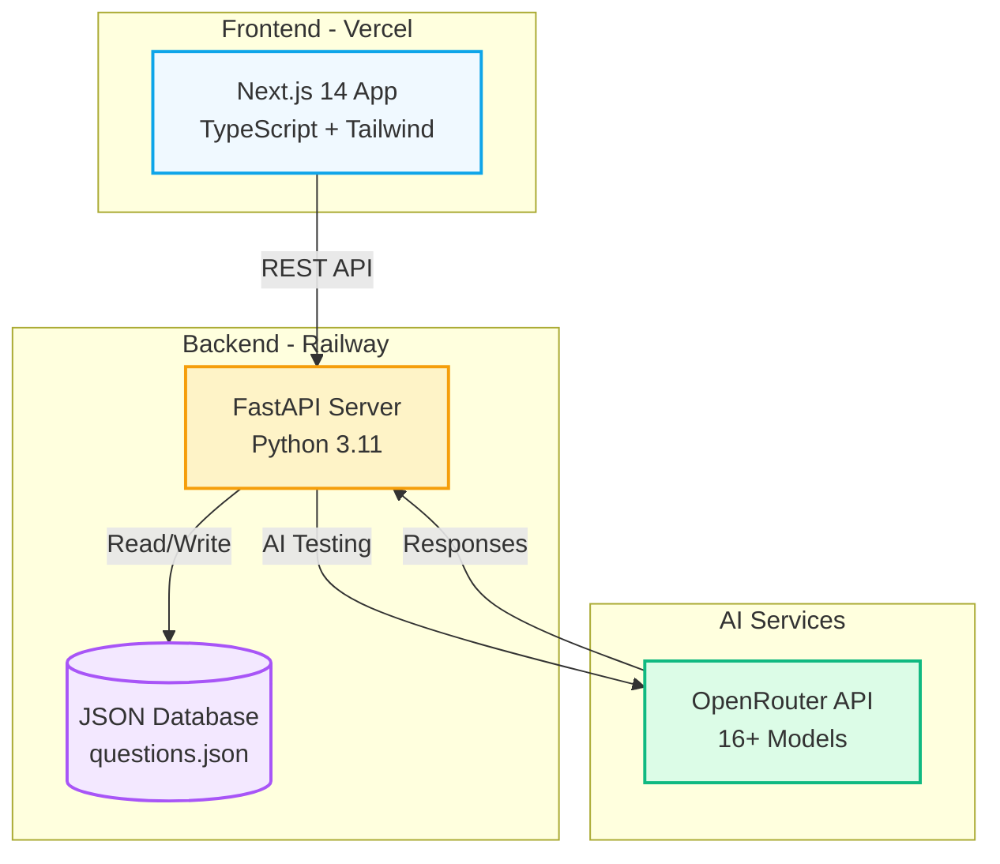

# Adversarial Assessment Design (AAD) Framework

A full-stack web application that helps faculty design AI-resistant assessments by measuring and reducing the "Exploitability Score" (ES) of their questions.

## Live Demo

- **Frontend:** <https://ai-vulnerability-edu.vercel.app>
- **Sample Question:** <https://ai-vulnerability-edu.vercel.app/question/nlp_003>
- **Backend API:** <https://ai-vulnerability-edu.up.railway.app>
- **API Health:** <https://ai-vulnerability-edu.up.railway.app/health>
- **API Documentation:** <https://ai-vulnerability-edu.up.railway.app/docs>

## Overview

With AI tools like ChatGPT becoming ubiquitous, traditional assessments face new challenges. The AAD Framework:

- Measures vulnerability by calculating an Exploitability Score (ES) showing how easily AI can complete an assessment
- Tests with real AI using 16 models including GPT-4, Claude 3.5, Gemini, Llama, and Mistral via OpenRouter API
- Provides actionable recommendations to redesign vulnerable questions
- Performs statistical analysis to identify what makes questions AI-resistant

## Architecture



**Key Features:**
- All questions stored in backend database at `backend/data/questions.json`
- Real API integration between frontend and backend
- Persistent test results across sessions
- Real-time AI testing with multiple models
- Type safety with Pydantic (backend) and TypeScript (frontend)

## Quick Start

### Prerequisites

- Python 3.11+ with Anaconda
- Node.js 18+ and npm
- OpenRouter API Key (see DEPLOYMENT_GUIDE.md for free models)

### Backend Setup

```bash
cd backend

# Activate conda environment
conda activate common_lt

# Install dependencies
pip install -r requirements.txt

# Configure environment variables
cp .env.example .env
# Edit .env and add your OPENROUTER_API_KEY

# Start server
python main.py
```

API available at `http://localhost:8000`
- Documentation: `http://localhost:8000/docs`
- Health check: `http://localhost:8000/api/health`

### Frontend Setup

```bash
cd frontend

# Install dependencies
npm install

# Configure environment
echo "NEXT_PUBLIC_API_URL=http://localhost:8000" > .env.local

# Start development server
npm run dev
```

Application available at `http://localhost:3000`

## Exploitability Score (ES) Calculation

```
ES = (0.15 × bloom_factor) + (0.25 × context_factor) + 
     (0.25 × novelty_factor) + (0.35 × ai_accuracy)
```

**Factors:**
- Bloom's Taxonomy (1-6): 1=Remember, 6=Create
- Context Dependency (1-5): 1=Generic, 5=Course-specific
- Novelty (1-5): 1=Common, 5=Unique
- AI Accuracy (0-100): Average performance across models

**Interpretation:**
- 0-30: AI-Resistant
- 30-50: Moderately Resistant
- 50-70: Moderately Vulnerable
- 70-100: Highly Vulnerable

Lower ES indicates more AI-resistant questions.

## Sample Data

The backend includes 30 realistic NLP course questions:

- 10 highly vulnerable (ES > 70): Simple recall questions
- 15 moderately vulnerable (ES 40-70): Application/analysis questions
- 5 AI-resistant (ES < 30): Project-based, context-heavy questions

## Tech Stack

**Backend:**
- FastAPI - Modern async Python web framework
- Pydantic - Data validation and settings
- Pandas/NumPy/SciPy - Statistical analysis
- OpenRouter - Multi-model AI access

**Frontend:**
- Next.js 14 - React framework with App Router
- TypeScript - Type safety
- Tailwind CSS - Utility-first styling
- Recharts - Data visualization

## API Endpoints

### Questions
```
GET    /api/questions              # List all questions
GET    /api/questions/{id}         # Get single question
POST   /api/questions              # Create question
PUT    /api/questions/{id}         # Update question
DELETE /api/questions/{id}         # Delete question
```

### AI Testing
```
POST   /api/test/single            # Test question with AI model
POST   /api/test/batch             # Test multiple questions
GET    /api/test/results/{id}      # Get test results
```

### ES Calculation
```
POST   /api/es/calculate           # Calculate ES with all criteria
POST   /api/es/predict             # Estimate ES from criteria only
```

### Analysis
```
GET    /api/analysis/statistics    # Overall statistics
GET    /api/analysis/correlation   # Correlation matrix
POST   /api/analysis/regression    # Regression analysis
GET    /api/analysis/export        # Export data (JSON/CSV)
```

## Available AI Models

**Free Modern Models (10):**
- Meta Llama 3.1 8B Instruct
- Meta Llama 3.1 70B Instruct
- Google Gemini 1.5 Flash
- Google Gemini 1.5 Pro
- Mistral 7B Instruct
- Mixtral 8x7B Instruct
- Microsoft Phi-3 Mini
- Microsoft Phi-3 Medium
- Alibaba Qwen 2 7B

**Baseline Models (2):**
- OpenAI GPT-3.5 Turbo
- HuggingFace Zephyr 7B Beta

**Premium Models (4):**
- OpenAI GPT-4o
- OpenAI GPT-4o Mini
- Anthropic Claude 3.5 Sonnet
- Anthropic Claude 3 Haiku

## Project Structure

```
demo_app/
├── README.md                      # This file
├── DEPLOYMENT_GUIDE.md            # Cloud deployment instructions
├── RENDER_NOTES.md                # Data persistence notes
├── vercel.json                    # Vercel configuration
├── render.yaml                    # Render configuration
├── backend/
│   ├── main.py                    # FastAPI entry point
│   ├── requirements.txt           # Python dependencies
│   ├── .env.example              # Environment template
│   ├── app/
│   │   ├── config.py             # Configuration
│   │   ├── models/schemas.py     # Pydantic models
│   │   ├── api/                  # API endpoints
│   │   │   ├── questions.py
│   │   │   ├── testing.py
│   │   │   ├── es.py
│   │   │   └── analysis.py
│   │   ├── services/             # Business logic
│   │   │   ├── es_calculator.py
│   │   │   └── openrouter.py
│   │   └── utils/
│   │       └── database.py       # Data storage
│   └── data/
│       └── questions.json        # Question database
└── frontend/
    ├── app/
    │   ├── layout.tsx
    │   ├── page.tsx
    │   └── question/[id]/
    │       └── page.tsx          # Question detail view
    ├── lib/
    │   ├── api-client.ts         # API communication
    │   └── types.ts              # TypeScript interfaces
    └── [configuration files]
```

## Development

```bash
# Backend with auto-reload
cd backend
uvicorn main:app --reload --host 0.0.0.0 --port 8000

# Frontend with hot reload
cd frontend
npm run dev
```

## Testing

Visit `http://localhost:8000/docs` for interactive API documentation.

**Example API calls:**

```bash
# Get all questions
curl http://localhost:8000/api/questions

# Get statistics
curl http://localhost:8000/api/analysis/statistics

# Calculate ES
curl -X POST http://localhost:8000/api/es/calculate \
  -H "Content-Type: application/json" \
  -d '{"bloomLevel": 1, "contextDependency": 1, "novelty": 1}'

# Test with AI model
curl -X POST http://localhost:8000/api/test/single \
  -H "Content-Type: application/json" \
  -d '{"questionId": "nlp_003", "model": "meta-llama/llama-3.1-8b-instruct:free"}'
```

## Deployment

See [DEPLOYMENT_GUIDE.md](./DEPLOYMENT_GUIDE.md) for complete instructions on deploying to:
- Vercel (Frontend)
- Render (Backend)

Both platforms offer free tiers suitable for this application.

## Environment Variables

**Backend (.env):**
```bash
OPENROUTER_API_KEY=sk-or-v1-your-api-key-here
ALLOWED_ORIGINS=*
ENVIRONMENT=production
```

**Frontend (.env.local or .env.production):**
```bash
NEXT_PUBLIC_API_URL=https://your-backend.onrender.com
```

## Key Insights

From statistical analysis of sample data:

- **Bloom's Level** has strong negative correlation with ES
- **Context Dependency** significantly reduces AI exploitability
- **Novelty** makes questions harder for AI to answer

**Recommendation:** To create AI-resistant assessments, design questions that:
- Target Bloom's levels 4-6 (Analyze, Evaluate, Create)
- Incorporate course-specific projects and context
- Use unique institutional scenarios

## License

MIT License - See LICENSE file for details.

## Notes

This is a demonstration application. For production deployment, consider:
- PostgreSQL or another persistent database (see RENDER_NOTES.md)
- Authentication and authorization
- Rate limiting for API endpoints
- Caching for improved performance
- Comprehensive error handling
- Unit and integration tests
